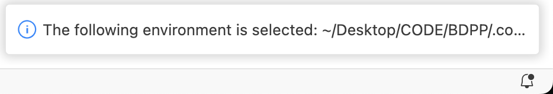

# Big Data Parallel Programming Course (LAB 1: Installation using Conda inside VS Code)

## Pre-requesters
- This Lab is done in VS code

## Create VS Code Project Folder using file explorer or command line 

## Open Project in VS Code

## Create conda environment
Press Ctrl+Shift+P (Windows/Linux) or Cmd+Shift+P (Mac) to open the Command Palette.

In the Command Palette, type Python: Create Environment and select it.

Select conda environment

Select Python 3.8

You should see something similar at the bottom right corner

## Open VS Code Terminal and check currently activated conda environment

`conda env list` will list available environments and highlight (*) the current activated one

## Install Apache Spark
### Check Java version inside the conda environment
``java -version``
#### If 8 > JDK > 17, Install JDK 17
``conda install -c conda-forge openjdk=17``
#### Check Java version inside the conda environment again
``java -version``
### Install pyspark pandas and pyarrow
``pip install pyspark pandas pyarrow``

## delete conda environment (ONLY IF YOU HAVE MADE A MISTAKE)
``conda env remove --name <env name>``

## Run quick starter
Download [quickstart_df.ipynb](quickstart_df.ipynb) and try running it.

# References
## Conda 
- https://docs.conda.io/projects/conda/en/latest/user-guide/install/index.html
- https://www.anaconda.com/docs/getting-started/miniconda/main

## PySpark
- Overview https://spark.apache.org/docs/latest/api/python/index.html
- Installation https://spark.apache.org/docs/latest/api/python/getting_started/install.html